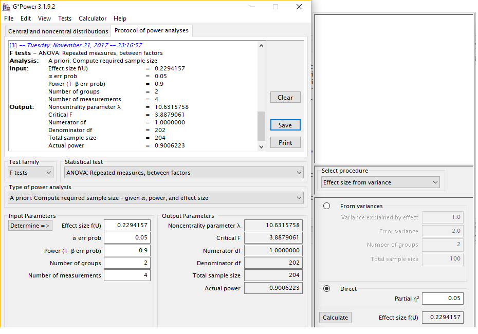
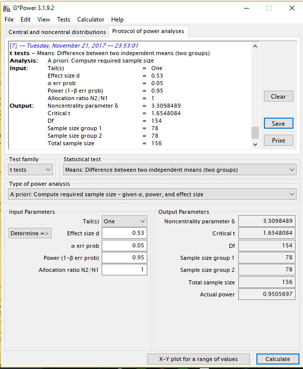
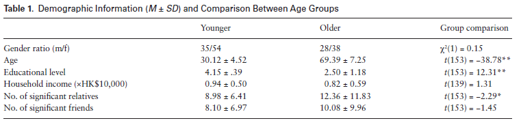
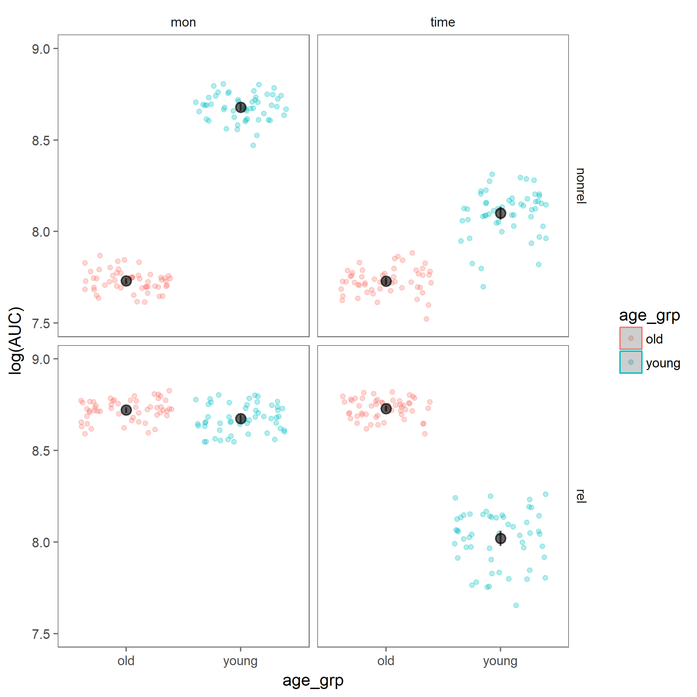

##Introduction

  Socioemotional Selectivity Theory (SST- Carstensen, 2006) postulates that due to a sense of limited time left in life older adults are motivated to engage with meaningful activities over ones that might provide future benefits. Yet, despite being thought of as a meaningful activity (Greenfield & Marks, 2004), older adults do not volunteer in higher rates compared to younger cohorts (U.S Bureau of Labor, 2015). The relatively low volunteer rates among older adults is especially surprising since laboratory experiments found that older adults show more prosocial behaviors compared to younger adults, and are more concerned with the wellbeing of others in need (Sze, Gyurak, Goodkind, &  Levenson, 2012; Beadle, Sheehan, Dahlben, & Gutchess, 2013;  Hubbard, Harbaugh, Srivastava, Degras, & Mayr, 2016)


  The study I attempt to replicate by Gong, Zhang, & Fung (2017) provides a possible explanation for this apparent discrepancy. In a hypothetical donation task, Gong and colleagues asked younger (N=89) and older (N=66) Hong Kong Chinese community membersto indicate how much money and time they are willing to donate to a person in need, with this person being progressively more socially distant to them. They found: a *weak qualified* main effect ($\eta_p^2$=0.05) of age such that older adults were less generous than younger adults when averaging across donation (money or time) and kinship (relative or non-relative) types. However, they found a 3-way Age group X Donation X Kinship interaction showing that *when donating their time to relatives, older adults were more generous than younger adults*. This post-hoc test had a medium effect size (*Cohen's D*=`r round(((2*3.22)/sqrt(145)),2)`, calculated based on reported t-statistic of $t_{(145)}$=3.22). **the qualified main effect of age group and the post-hoc test suggesting that older adults are more generous than younger adults when donating time to relatives are the two target findings for this replication**. 
  
  In addition, their post-hoc comparisons revealed that older adults, compared to younger adults, were less generous to non-relatives in monetary donations but the groups did not differ in generousity towards relatives in this donation condition. In contrast, older adults were less generous than younger adults when donating time to non-relatives (but were more generous to relatives as noted above). 
  
  Gong, Zhang and Fung were also interested in comparing the social discount rate of older and younger adults in each of the conditions. They found no main effects of social discounting, and an Age group X Donation type interaction. Post-hoc tests revealed that older and younger adults' social discount rates did not differ when donating time, and that compared to younger adults older adults had higher discount rates when donating money to relatives and non-relatives alike. They conclude that their findings regarding donation amounts and social discount rates are in accord with SST- older adults are affected more than younger adults by kinship and degree of social closeness, though these effects depend on the context of giving.

##Methods

###Power Analysis

The original effect sizes of interest were: $\eta_p^2$=0.05 for the qualified main age group effect effect, and *D*=`r round(((2*3.22)/sqrt(145)),2)` for the post-hoc t-test on generosity of time donations for relatives. 

Power analysis using G*Power version 3.1.2.9 suggested that in order to obtain 80%, 90% and 95% power for the main effect of age, the required sample sizes are 154, 204, and 252 respectively (details can be found here: 

**Age group main effect- 80% power**
, 

**Age group main effect- 90% power**


**Age group main effect- 95% power**
 

In order to obtain 80%, 90%, and 95% power to observe the stronger effect of age group on generosity in time donations to relatives (Older>Younger), requires sample sizes of 90 (45 per group), 124 (62 per group), and 156 (78 per group) respectively. Details can be found here:

**age group time donations, relatives- 80% power**


**age group time donations, relatives- 90%** 


**age group time donations, relatives- 95%** 


**Feasability-** Since the task requires about 10 minutes to complete online, and since the required samples are somewhat large, the replication study will be powered to observe the stronger effect of age group on generosity in time donations to relatives at 80% power.

###Planned Sample

The above mentioned power calculation suggests that a sample consisting of **45 older adults** (aged 60 or older), and **45 younger adults** (aged 35 or younger) will suffice to achieve 80% to detect the effect of interest. We will rely on Amazon's mechanical Turk for data colelction, and sample only U.S residents to minimize the chance that participants do not read English.

###Materials

In this study, age group is treated as a between subjects independent variable. Participants in both age groups completed the same experimental task. At first, the were given the following instruction:

> "The following task asks you to imagine that you have a list of 100 relatives (or non-relatives) arranged in descending order of their closeness with you. The person at position #1 is your closest relative (or non-relative), while the person at position #100 is a relative (or nonrelative) you may know but are not close at all. You do not have to actually create the list-- just imagine that you have done so. Next you will be asked to answer questions regarding these relatives (or non-relatives) at a given position."

Participants were then asked to indicate how much money and time they would be willing to hypothetically donate to a person in a given position (N) on that list (N=1,2,5,10,20,50, and 100). The promt read as follows:

> "Imagine that the relative (or non-relative) at position N on your list is now hospitalized. He/she needs to be accompanied and taken care of in the hospital, as well as a large amount of money to pay for the medical expense. If you now own 100 thousand of Hong Kong dollars and 100 days of vacation, how much money would you donate to him/her, and how many days would you spend taking care of him/her?"

These materials are used verbatim in the replication attempt, with the exception of replacing "Hong Kong dollars" with "U.S dollars". The original authors' advice was sought in order to decide whether to change the amount to the $U.S equivalent of 100 thousand Hong Kong dollars (~18 thousand U.S dollars). The first author indicated that it is better to retain the value of 100 thousand and change only the currency.

###Procedure	

Participants first provided demographic information regarding their age, gender, level of education and household income. In addition, participants were asked to "*directly estimate the number of important relatives/ friends*" that they have, since this was seen as an important control variable.

Participants then completed the Chinese version of the Alzheimer's Disease Assessment Scale-Cognitive Subscale (ADAS-Cog). Since this is an in-person assesment, **this stage is not followed in the replication study**. 

Participants then proceeded to the hypothetical donation task reported above. 

**For the replication attempt**- In order to recruit participants on Amazon's Mechanical Turk, two surveys were set on using the Qualtrics platform. one survey was desigend to allow only people who indicate their age as being over 60 to take the survey, while the other was designed to allow only those who indicate their age as being under 35 to proceed to the survey. Participants who accept the HIT, are compensated \$0.1 for taking the short demographic survey (including age and the demographic variables detailed above), and could opt to recieve a bonus payment of \$1.21 by completeing the experimental task. 

**links to working surveys**: 

[Older adults](https://stanforduniversity.qualtrics.com/jfe/form/SV_1G5Gp4eys77yAHr)

[Younger adults](https://stanforduniversity.qualtrics.com/jfe/form/SV_1QYqUm51SjqaQfP) 

###Analysis Plan
As a result of the replication study being done online, the two datasets (one with data from older participants and another with younger participants' data) first have to be merged. After this merger, the analysis proceeds as follows:

The analysis is based on fitting hyperbolic discount curves for each individual in each of the 2(donation form) X 2(kinship) conditions. This is done first on the group median values to assess the overall appropriateness of the function. 

> "To analyze the donation data, we first modeled the group donation data. For each age X donation form X kinship cell, a hyperbolic discount function (i.e., Equation 1) was fit to the group median values (Jones & Rachlin, 2006; Rachlin & Jones, 2007, 2008) over the seven social distances (N = 1, 2, 5, 10, 20, 50, and 100):

> $\nu$ = V / (1 + $\kappa$N) $_{(1)}$

> where V is the undiscounted reward value, v is the reward value that a person would like to forgo for the benefit for someone at a social distance N, and k is a constant indexing degree of social discounting (i.e., discount rate) across social distances. Following the convention of the literature, group median values instead of mean values were used"

After assuring that the hypoerbolic discount curve fit the group data well by computing the Root Mean Square Error (RMSE) and variance explaines ($R^2$), the same curve is fit for each participant, extracting the values for Area under the curve (*AUC*) as an indicator of overall generosity, and discount rate ($\kappa$):

> "Once the appropriateness of the hyperbolic discount function was confirmed for group data, we then conducted the same fitting process to individual data to get the discount rate ($\kappa$) and the *AUC* for each participant under different conditions. Again following the convention of the literature, individual data that did not fit the hyperbolic discount function were excluded from further analyses (Vuchinich & Simpson, 1998). The individuals' $\kappa$ and *AUC* values were then normalized by a natural logarithm transformation (e.g., Margittai et al., 2015), and transformed values that exceeded ±3 SDs were treated as outliers."

The individual *AUC* and $\kappa$ values are then entered to a dataset comprising of 4 rows per participant corresponding to the four 2X2 cells. To analyze these data:

> "the transformed individual *AUC* values and $\kappa$ values were submitted respectively to a 2 (age: younger and older) X 2 (donation form: money and time) X 2 (kinship: relatives and nonrelatives) mixed design, repeated measures ANOVA (and post hoc tests), with and without controlling for demographic variables"

**Key analysis of interest-** The mixed design repeated measure ANOVA of *AUC* values is the main interest for the purpose of this replication, with the post hoc test comparing older and younger adults' *AUC* values when donating time to relatives. 

"Main" effect of age will be taken as the affect of Age when controlling for all other main independent variables and their interactions (type III sum of squares, as is typically used in Statistical programs). The authors did not specify the type of post-hoc test used to examine group differences in each condition. Since there are relatively few (4) pairwise comparisons in this test, and out of desire to be cautious, I will use the Bonferroni correction to deterimine the statistical significance of this test.
Though not of main interest for this replication, I will also run the same ANOVA and post-hoc procedures on individual $\kappa$ values.

**Additional analysis for this data-** Since this is a repeated measures dataset, a statistical procedure that is more robust to imbalances in the dataset is a mixed-effects linear model. I plan to run such a model setting a random intercept (different means) for individuals' AUC values and using planned orthogonal contrasts to test the specific group means difference of interest. Using planned contrasts, I first set the intercept to reflect the overall mean *AUC* value across age groups, donation and kinship conditions. In this case, the effect of age group reflects the "main" effect of age group. The contrast coding for the "age group" reflects the expectation that across donation and kinship conditions, the expectation is that younger adults are more generous.

Then, providing that the is a significant 3-way interaction as was founf in the original paper, I will set the intercept to reflect the *AUC* value for older adults when donating time to relatives. In this case, the "simple" effect of age group reflects the difference between older and younger adults when donating time to relatives. Any interactions between age group and condition indicate that that difference (or lack there of) may be significanlty reduced, non-present, or even flipped in depending on the particular donation X kinship combination.  

###Differences from Original Study

This replication is different form the original study in a number of ways: 

First, the original study sampled Honk-Kong Chinese, which might have different prosocial behavior patterns than U.S citizens. However, the authors did not state in their study that their result should only extend to a particular cultural/ethnic group. 

Second, as noted above, the amount of money participants are instructed to imagine having is different in relative terms. 100 thousand Hong Kong dollars are considerably less valuable (in terms of purchase power) then 100 thousand U.S dollars, even when adjusting to the difference in cost of living between the two countries. However, as stated, the primary author of the original paper instructed the author of this replication to keep the value to 100 thousand and change only the currency. 

Third, the original study was conducted in lab and included a cognitive assesment procedure. The replication is taking place on Amazon's mechanical Turk and does not include cognitive assessment. The decision to drop this assesment was made since the original paper did not find a relationship between performance and cognitive ability, and the first author of the original paper stated in a personal communication that he does not think that this procedure would alter participants' mindsets. 


```{r include=FALSE}
### Methods Addendum (Post Data Collection)
#You can comment this section out prior to final report with data collection.
```


#### Actual Sample
  In Pilot A, reported here, responses of `r 6+14` potential participants were recorded. In order to pilot the data cleaning procedures, some of the participants purposefully provided answers that rendered them ineligible. The final sample consisted of 3 non-naive older participants and 3 non-naive younger participants.

#### Differences from pre-data collection methods plan
Since this pilot was not done through Amazon Mechanical Turk, possible issues with interacting with that platform for not tested.

In addition, after fitting the curves to the group median values, it turned out that fitting the function for the monetary donation requires dividing the raw amounts by 1000. For that reason, all analysis were run on these transformed values.


##Results


### Data preparation

Data preparation following the analysis plan.
	
```{r include=TRUE, results='hide', error=FALSE, warning=FALSE, message=FALSE}
####Load Relevant Libraries and Functions
library(knitr)
library(tidyverse)
library(ggplot2)
library(car)
library(ez)
library(broom)
library(pander)
library(kableExtra)
library(lme4)
library(lmerTest)

# compute the hyperbolic function
discount <- function (V, k, N) {
  nu <- V / (1 + k * N)
  
  return(nu)
}

# compute RMSE for a given parameter set and data
data_vs_discount <- function(V, k, N, amount) {
  nu <- discount(V, k, N)
  
  RMSE <- sqrt(mean((amount - nu)^2))
  
  return(RMSE)
}
```

####Import data
```{r include=TRUE, results='hide', error=FALSE, warning=FALSE, message=FALSE}

#load 'raw' data sets
df_old=read.csv("Pilot_A_older_raw.csv")
df_young=read.csv("Pilot_A_young_raw.csv")

#clean each data set
## df_old
colnames(df_old) <- as.character(unlist(df_old[1,]))
df_old=df_old[-c(1,2),]

#varaibles to remove
vars_remove=c('Start Date', 'End Date', 'Response Type', 'IP Address', 'Progress', 'Duration (in seconds)', 'Finished', 'Recorded Date', 'Recipient Last Name', 'Recipient First Name', 'Recipient Email','External Data Reference', 'Location Latitude', 'Location Longitude', 'Distribution Channel', 'User Language', 'issues_not_eligible', 'issues_not_interested', 'gender - Other: - Text', 'race - Other: - Text', 'issues_participant')

df_old=df_old%>%select(-one_of(vars_remove))

##df_young
colnames(df_young) <- as.character(unlist(df_young[1,]))
df_young=df_young[-c(1,2),]

df_young=df_young%>%select(-one_of(vars_remove))

#merge the two data sets
df_og=full_join(df_old,df_young)
```

#### Data exclusion / filtering
```{r results='hide', error=FALSE, warning=FALSE}
#Retain only participants who responded "yes" to bonus_interested, and passed attention check
df_og=df_og%>%filter(Bonus_eligible_interested=="Yes", attn_chk_20==20)
```

#### Prepare data for analysis
```{r include=TRUE, results='hide', error=FALSE, warning=FALSE}
#retain only vars used in analysis
vars_remove=c('Bonus_eligible_interested', 'attn_chk_20')
df_og=df_og%>%select(-one_of(vars_remove))

#Add age group variable
df_og$age_grp=recode(df_og$age, "lo:35='young'; 60:hi='old'", as.factor.result = T)
summary(df_og$age_grp) #-> 3 of each

#Rename variables to be more readable
df_og=df_og%>%rename(subid=`Response ID`, gender=`gender - Selected Choice`, race=`race - Selected Choice`)

#Recode education to numeric
df_og$edu_lv=recode(df_og$education_level, "'Primary school or lower'=1; 'Middle school'=2; 'High school'=3; 'Undergraduate (College or equivalent)'=4; 'Graduate school or higher'=5", as.numeric.result = T)

#Recode subid into numbers (but still factor)
df_og$subid=as.factor(df_og$subid)
df_og$subid=as.numeric(df_og$subid)
df_og$subid=as.factor(df_og$subid)
str(df_og$subid)

#Make sure all variables that should be numeric are numeric
is.numeric(df_og$age); is.numeric(df_og$income); is.numeric(df_og$imp_relative_num); is.numeric(df_og$imp_friends_num); is.numeric(df_og$rel_1_mon); is.numeric(df_og$rel_1_time); is.numeric(df_og$nonrel_1_mon); is.numeric(df_og$nonrel_1_time)#-> All FALSE

#Recode all variables that should be numeric into numeric
df_og[,c(3,5:7,9:36)]=as.numeric(unlist(df_og[,c(3,5:7,9:36)])) #-> columns 3, 5:7 & 9:36 (all numeric vars)

#check
is.numeric(df_og$age); is.numeric(df_og$income); is.numeric(df_og$imp_relative_num); is.numeric(df_og$imp_friends_num); is.numeric(df_og$rel_1_mon); is.numeric(df_og$rel_1_time); is.numeric(df_og$nonrel_1_mon); is.numeric(df_og$nonrel_1_time)#-> all true!

#long-form dataset
og_lng=df_og%>%
  gather(condition, amount,
         rel_1_mon,rel_2_mon,rel_5_mon,rel_10_mon,rel_20_mon, rel_50_mon, rel_100_mon,
         rel_1_time,rel_2_time,rel_5_time,rel_10_time,rel_20_time, rel_50_time, rel_100_time,
         nonrel_1_mon,nonrel_2_mon,nonrel_5_mon,nonrel_10_mon,nonrel_20_mon, nonrel_50_mon, nonrel_100_mon,
         nonrel_1_time,nonrel_2_time,nonrel_5_time,nonrel_10_time,nonrel_20_time, nonrel_50_time, nonrel_100_time
         )%>%
  separate(condition, c("kin", "soc_dist", "donation"), "_")%>%
  spread(kin, amount)%>%
  gather(kinship, amount,
         rel,nonrel) #-> That works!

```

### Confirmatory analysis

#### Demographic data
```{r echo=TRUE, results='hide', error=FALSE, warning=FALSE}
#table of descpritive statistics
dscrpt=df_og%>%group_by(age_grp)%>%summarise(male_female_ratio=paste(sum(gender=="Male"), "/", sum(gender=="Female")),
Age_av=round(mean(age),2),Age_sd=round(sd(age),2), 
Education_av=round(mean(edu_lv),2),Education_sd=round(sd(edu_lv),2), Household_income_av=round(mean(income),2),Household_income_sd=round(sd(income),2), sig_relatives_av=round(mean(imp_relative_num),2),sig_relatives_sd=round(sd(imp_relative_num),2), 
sig_friends_av=round(mean(imp_friends_num),2), sig_friends_sd=round(sd(imp_friends_num),2))

dscrpt2=dscrpt%>%rename('Age group'=age_grp, 'Male/Female ratio'=male_female_ratio)%>%unite('Age (m | sd)', c('Age_av', 'Age_sd'), sep=" | ")%>%unite('Education level (m | sd)', c('Education_av', 'Education_sd'), sep=" | ")%>%unite('Household income (m | sd)', c('Household_income_av', 'Household_income_sd'), sep=" | ")%>%unite('Important relatives (m | sd)', c('sig_relatives_av', 'sig_relatives_sd'), sep=" | ")%>%unite('Important friends (m | sd)', c('sig_friends_av', 'sig_friends_sd'), sep=" | ")

```

```{r test for differences, include=TRUE, results='hide', error=FALSE, warning=FALSE}
#Gender (chi-square)
gen=chisq.test(df_og$gender, df_og$age_grp, rescale.p = T, correct = F)
#Age
age=t.test(data=df_og, age~age_grp)
#education level
edu_lv=t.test(data=df_og, edu_lv~age_grp)
#income level
inc_lv=t.test(data=df_og,income~age_grp)
#number of close relatives
rel=t.test(data=df_og, imp_relative_num~age_grp)
#number of close friends
frnd=t.test(data=df_og,imp_friends_num~age_grp)

pander(gen, digits=2, caption = "chi-square test for gender differences")
pander(age, digits=2, caption = "age group difference in average age")
pander(edu_lv, digits=2, caption = "age group difference in levels of education")
pander(inc_lv, digits=2, caption = "age group difference in average income")
pander(rel, digits=2, caption = "age group difference in average number of relatives")
pander(frnd, digits=2, caption = "age group difference in average number of friends")

```


In table 1, we compare the two age groups' demographic variables. In the original paper, older adult participants were significanlty older, less educated, and had significanlty more important relatives. There were no significant differences in income nor number of important friends (see figure 1. for original table).

In this small pilot,the older adult group was significantly older ($t_{(3.8)}$=`r round(age$statistic,2)`, *p*=`r round(age$p.value, 3)`) and less educated ($t_{(4)}$=`r round(edu_lv$statistic,2)`, *p*=`r round(edu_lv$p.value, 3)`). We did not find additional significant differences between the groups.

**Figure 1: Gong et al., 2017 descpriptive statistics by age group**


`r kable(dscrpt2,align='c', caption = "Table 1: decsriptive statistics by age group")`

#### Fitting the curve for age group median values (for each donation X kinship condition)
```{r median values, include=TRUE, results='hide', error=FALSE, warning=FALSE}
#create df with monetary amounts divided by 1000 for plotting and analyses (to have the same units for time and money donations)
df_og2=df_og%>%mutate(rel_1_mon=rel_1_mon/1000, rel_2_mon=rel_2_mon/1000, rel_5_mon=rel_5_mon/1000, rel_10_mon=rel_10_mon/1000, rel_20_mon=rel_20_mon/1000, rel_50_mon=rel_50_mon/1000, rel_100_mon=rel_100_mon/1000, nonrel_1_mon=nonrel_1_mon/1000, nonrel_2_mon=nonrel_2_mon/1000, nonrel_5_mon=nonrel_5_mon/1000, nonrel_10_mon=nonrel_10_mon/1000, nonrel_20_mon=nonrel_20_mon/1000, nonrel_50_mon=nonrel_50_mon/1000, nonrel_100_mon=nonrel_100_mon/1000)

#long-form this dataframe
og_lng2=df_og2%>%
  gather(condition, amount,
         rel_1_mon,rel_2_mon,rel_5_mon,rel_10_mon,rel_20_mon, rel_50_mon, rel_100_mon,
         rel_1_time,rel_2_time,rel_5_time,rel_10_time,rel_20_time, rel_50_time, rel_100_time,
         nonrel_1_mon,nonrel_2_mon,nonrel_5_mon,nonrel_10_mon,nonrel_20_mon, nonrel_50_mon, nonrel_100_mon,
         nonrel_1_time,nonrel_2_time,nonrel_5_time,nonrel_10_time,nonrel_20_time, nonrel_50_time, nonrel_100_time
         )%>%
  separate(condition, c("kin", "soc_dist", "donation"), "_")%>%
  spread(kin, amount)%>%
  gather(kinship, amount,
         rel,nonrel)

#set varaible soc_dist in og_lng to be numeric in both dataframes
#original df
og_lng$soc_dist=as.character(og_lng$soc_dist)
og_lng$soc_dist=as.numeric(og_lng$soc_dist)
is.numeric(og_lng$soc_dist)

#df for plotting and analysis (og_lng2)
og_lng2$soc_dist=as.character(og_lng2$soc_dist)
og_lng2$soc_dist=as.numeric(og_lng2$soc_dist)
is.numeric(og_lng2$soc_dist)

#create table with original median values
med_table=og_lng%>%group_by(age_grp,kinship,donation,soc_dist)%>%summarise(med_amnt=median(amount))
#create table of median values with the tranformed monetary amounts
med_table2=og_lng2%>%group_by(age_grp,kinship,donation,soc_dist)%>%summarise(med_amnt=median(amount))

#generate plot
med_plots=ggplot(data=med_table2, aes(x=soc_dist, y=med_amnt, color=age_grp))+
  geom_point(position = "jitter")+
  geom_smooth(method = "lm", formula = y~poly(x,2), se=F)+
  facet_wrap(donation~kinship)+
  xlab("Social Distance")+
  ylab("Median group amount, moneyX1000 or days")+
  ggtitle("Donation amounts by social distance for older and younger adults")+
  ggthemes::theme_few()
```


```{r curve fitting-median values, include=TRUE, results='hide', error=FALSE, warning=FALSE}
#define dataset
d=med_table2

#create empty vectors to store values
age_grp=vector(mode="character",length=0); donation=vector(mode="character",length=0); kinship=vector(mode="character",length=0); V_values=vector(mode="numeric",length=0); k_values=vector(mode="numeric",length=0); RMSE=vector(mode="numeric",length=0); R_sq=vector(mode="numeric",length=0)

#run for each age group, exctract values for donation * kinship conditions

for(i in unique(d$age_grp)){
  
  d_mon_rel=d%>%filter(age_grp==i, donation=="mon", kinship=="rel") #-> create temp df to get values from
  age_grp=c(age_grp,i) #-> store the appropriate age group
  donation=c(donation, "mon") #-> store the appropriate donation
  kinship=c(kinship, "rel") #-> store the appropriate kinship
  optim_discount_wrapper <- function(x) { #-> define discount wrapper to get V, k, and RMSE values for this                                                      condition
  return(data_vs_discount(V = x[1], k = x[2],  
                          N = d_mon_rel$soc_dist, 
                          amount = d_mon_rel$med_amnt))
}

  opt1=optim(c(100, .2), optim_discount_wrapper) #-> run discount_wrapper
  V_values=c(V_values,opt1$par[1]) #-> store resulting V_value
  k_values=c(k_values, opt1$par[2]) #-> store resulting k_value
  RMSE=c(RMSE, opt1$value) #-> store resulting RMSE value
  d_mon_rel$pred=discount(V = opt1$par[1], k = opt1$par[2],N = d_mon_rel$soc_dist) #-> store predictions in temp                                                                                          dataset
  cor1=cor.test(d_mon_rel$med_amnt, d_mon_rel$pred) #-> run cor.test to get correlation of predictions and data
  R_sq=c(R_sq, (cor1$estimate)^2) #-> square the estimate (pearson's R) to get R^2.
  
  
  d_mon_nonrel=d%>%filter(age_grp==i, donation=="mon", kinship=="nonrel") #-> do all of this for the next donation                                                                               * Kinship condition
  age_grp=c(age_grp,i)
  donation=c(donation, "mon")
  kinship=c(kinship, "nonrel")
  optim_discount_wrapper <- function(x) {
  return(data_vs_discount(V = x[1], k = x[2],  
                          N = d_mon_nonrel$soc_dist, 
                          amount = d_mon_nonrel$med_amnt))
}

  opt2=optim(c(100, .2), optim_discount_wrapper)
  V_values=c(V_values,opt2$par[1])
  k_values=c(k_values, opt2$par[2])
  RMSE=c(RMSE, opt2$value)
  d_mon_nonrel$pred=discount(V = opt2$par[1], k = opt2$par[2],N = d_mon_nonrel$soc_dist)
  cor2=cor.test(d_mon_nonrel$med_amnt, d_mon_nonrel$pred)
  R_sq=c(R_sq, (cor2$estimate)^2)


  d_time_rel=d%>%filter(age_grp==i, donation=="time", kinship=="rel")
  age_grp=c(age_grp,i)
  donation=c(donation, "time")
  kinship=c(kinship, "rel")
  optim_discount_wrapper <- function(x) {
  return(data_vs_discount(V = x[1], k = x[2],  
                          N = d_time_rel$soc_dist, 
                          amount = d_time_rel$med_amnt))
}

  opt3=optim(c(100, .2), optim_discount_wrapper)
  V_values=c(V_values,opt3$par[1])
  k_values=c(k_values, opt3$par[2])
  RMSE=c(RMSE, opt3$value)
  d_time_rel$pred=discount(V = opt3$par[1], k = opt3$par[2],N = d_time_rel$soc_dist)
  cor3=cor.test(d_time_rel$med_amnt, d_time_rel$pred)
  R_sq=c(R_sq, (cor3$estimate)^2)

  
  d_time_nonrel=d%>%filter(age_grp==i, donation=="time", kinship=="nonrel")
  age_grp=c(age_grp,i)
  donation=c(donation, "time")
  kinship=c(kinship, "nonrel")
  optim_discount_wrapper <- function(x) {
  return(data_vs_discount(V = x[1], k = x[2],  
                          N = d_time_nonrel$soc_dist, 
                          amount = d_time_nonrel$med_amnt))
}

  opt4=optim(c(100, .2), optim_discount_wrapper)
  V_values=c(V_values,opt4$par[1])
  k_values=c(k_values, opt4$par[2])
  RMSE=c(RMSE, opt4$value)
  d_time_nonrel$pred=discount(V = opt4$par[1], k = opt4$par[2],N = d_time_nonrel$soc_dist)
  cor4=cor.test(d_time_nonrel$med_amnt, d_time_nonrel$pred)
  R_sq=c(R_sq, (cor4$estimate)^2)

}

#Add all vectors to one dataset
med_smry=as.data.frame(cbind(`Age group`=age_grp, Donation=donation, Kinship=kinship, V=V_values, k=k_values, `R sqr`=R_sq, RMSE), row.names = F)%>%mutate(V=as.character(V), k=as.character(k), `R sqr`=as.character(`R sqr`), RMSE=as.character(RMSE))%>%mutate(V=as.numeric(V), k=as.numeric(k), `R sqr`=as.numeric(`R sqr`), RMSE=as.numeric(RMSE))

kable(med_smry, digits = 2, align = "c", caption = "Estimated Parameters and Goodness-of-fit Indices of the Hyperbolic Functions, group median values")

#set data to create similar median amounts plots to the one appearing in the original paper.
med_table_plot=med_table2%>%unite('Age-Kinship', c('age_grp', 'kinship'), sep=" - ")

med_plot1=ggplot(data=med_table_plot, aes(x=soc_dist, y=med_amnt, color=`Age-Kinship`))+
  geom_point(position = "dodge", aes(shape=`Age-Kinship`))+
  #geom_smooth(method = "lm", formula = y~poly(x,1),se=F)+
  ylim(0,100)+
  facet_grid(donation~.)+
  xlab("Social Distance")+
  ylab("Median group amount, moneyX1000 or days")+
  ggtitle("Donation amounts by social distance for older and younger adults")+
  ggthemes::theme_few()
```


As a necessary first step, I first extracted the median donation values for each age group in each of the four donation X kinship conditions. Plotting the data, it appears that compared to the median donation values in the origianl study, values in this small pilot sample were fairly similar, yet far less variable (see figure 2.b).

**Figure 2a- Median donation values and hyperbolic curve- Gong et al., 2017**
                              

**Figure 2b- Median donation values, Pilot A**
```{r, echo=FALSE, warning=FALSE}
med_plot1
```

I proceded to fit the hyperbolic discount function to the group median donation values, with the aim of achiving similar goodness-of-fit indices to those obtained by Gong et al. As shown in table 2, the fit (assessed by $R^2$ and *RMSE*) was as good as in the original paper (see figure 3.) the values in the original paper.  

**Figure 3: Gong et al., 2017- V, $\kappa$ and Fit measures for group median values, by condition**


`r kable(med_smry, digits = 2, align = "c", caption = "Table 2: Parameters and Goodness-of-fit Indices of the Hyperbolic Functions, group median values")`

#### Main Analysis: AUC values
Since the hypoerbolic discount function fit the data well, I proceeded with the main analysis of interest: Comparing the two age groups' *AUC* values in each of the four conditions, with the aim of testing for a *qualified* main effect of age group indicating that younger adults are more generous than older adults, and a post hoc test for the difference between older and younger adults' generosity in donating time to relatives suggesting that older adults are more generous in this condition. 

```{r create dataframe for analysis, include=TRUE, results='hide', error=FALSE, warning=FALSE, message=FALSE}
#Create the empty dataframe, in which each participant have 4 rows
df2=as.data.frame(cbind(
  subid=rep(unique(og_lng2$subid),4),
  age_grp=c(),
  gender=c(),
  edu_lv=c(),
  incm_lv=c(),
  num_friends=c(),
  num_relatives=c(),
  kinship=c(),
  donation=c(),
  k=c(),
  AUC=c()
))

#Fill in values for demographics (age, age group, gender, education, income, num_friends, num_relatives)
for (i in unique(df2$subid)){
  df_sub=filter(df_og2, subid==i)
  df2[df2$subid==i, 'age']=df_sub$age
  df2[df2$subid==i, 'age_grp']=df_sub$age_grp
  df2[df2$subid==i, 'gender']=df_sub$gender
  df2[df2$subid==i, 'edu_lv']=df_sub$edu_lv
  df2[df2$subid==i, 'incm_lv']=df_sub$income
  df2[df2$subid==i, 'num_friends']=df_sub$imp_friends_num
  df2[df2$subid==i, 'num_relatives']=df_sub$imp_relative_num
}
```

```{r get individual k and AUC values, include=TRUE, results='hide', error=FALSE, warning=FALSE, message=FALSE}
#for each age individual, exctract values for donation * kinship conditions

#set varaible soc_dist in og_lng2 to be numeric
og_lng2$soc_dist=as.character(og_lng2$soc_dist)
og_lng2$soc_dist=as.numeric(og_lng2$soc_dist)
is.numeric(og_lng2$soc_dist)

#Get length of number of participants (n) as value
n_p=length(unique(df2$subid))

#Create 4 temporary df's to store values from each iteration
df2_mr=df2[1:n_p,] #-> for money_relative
df2_mnr=df2[(n_p+1):(n_p*2),] #->for money_nonrelative
df2_tr=df2[(2*n_p+1):(n_p*3),] #->for time_relative
df2_tnr=df2[(3*n_p+1):(n_p*4),] #->for time_nonrel

#rub discount wrapper for each subject in 2*2 conditions
for(i in unique(df2$subid)){
  #money relative
  d_mon_rel=og_lng%>%filter(subid==i, donation=="mon", kinship=="rel") #-> create temp df to get values from
  df2_mr[df2_mr$subid==i, 'donation']="mon" #-> store the appropriate donation
  df2_mr[df2_mr$subid==i, 'kinship']="rel" #-> store the appropriate kinship
  
  optim_discount_wrapper <- function(x) { #-> define discount wrapper to get V, k, and RMSE values for this                                                      condition
  return(data_vs_discount(V = x[1], k = x[2],  
                          N = d_mon_rel$soc_dist, 
                          amount = d_mon_rel$amount))
}

  opt1=optim(c(1000, .2), optim_discount_wrapper) #-> run discount_wrapper
  df2_mr[df2_mr$subid==i, 'k']=opt1$par[2] #-> store resulting k_value

  # Get AUC value - using WolframAlpha, the integral of this discount function is:
# V/k*ln(abs(1+k*n))+c -> we don't really care about c for AUC.
  k=opt1$par[2]
  V=opt1$par[1]

  #Evaluate for upper bound
  up=V/k*log(abs(1+k*100))
  lower=V/k*log(abs(1+k*0))

  df2_mr[df2_mr$subid==i,'AUC']=up-lower
  
#money nonrelative
  d_mon_nonrel=og_lng%>%filter(subid==i, donation=="mon", kinship=="nonrel") 
  df2_mnr[df2_mnr$subid==i, 'donation']="mon" 
  df2_mnr[df2_mnr$subid==i, 'kinship']="nonrel" 
  
  optim_discount_wrapper <- function(x) { 
  return(data_vs_discount(V = x[1], k = x[2],  
                          N = d_mon_nonrel$soc_dist, 
                          amount = d_mon_nonrel$amount))
}

  opt2=optim(c(1000, .2), optim_discount_wrapper) 
  df2_mnr[df2_mnr$subid==i, 'k']=opt2$par[2] 

  # Get AUC value 
  k=opt2$par[2]
  V=opt2$par[1]

  #Evaluate for upper bound
  up=V/k*log(abs(1+k*100))
  lower=V/k*log(abs(1+k*0))

  df2_mnr[df2_mnr$subid==i,'AUC']=up-lower
  
#time relative
  d_time_rel=og_lng%>%filter(subid==i, donation=="time", kinship=="rel")
  df2_tr[df2_tr$subid==i, 'donation']="time" 
  df2_tr[df2_tr$subid==i, 'kinship']="rel" 
  
  optim_discount_wrapper <- function(x) { 
  return(data_vs_discount(V = x[1], k = x[2],  
                          N = d_time_rel$soc_dist, 
                          amount = d_time_rel$amount))
}

  opt3=optim(c(1000, .2), optim_discount_wrapper) 
  df2_tr[df2_tr$subid==i, 'k']=opt3$par[2] 

  # Get AUC value 
  k=opt3$par[2]
  V=opt3$par[1]

  #Evaluate for upper bound
  up=V/k*log(abs(1+k*100))
  lower=V/k*log(abs(1+k*0))

  df2_tr[df2_tr$subid==i,'AUC']=up-lower
  
#time nonrelative
  d_time_nonrel=og_lng%>%filter(subid==i, donation=="time", kinship=="nonrel")
  df2_tnr[df2_tnr$subid==i, 'donation']="time" 
  df2_tnr[df2_tnr$subid==i, 'kinship']="nonrel" 
  
  optim_discount_wrapper <- function(x) { 
  return(data_vs_discount(V = x[1], k = x[2],  
                          N = d_time_nonrel$soc_dist, 
                          amount = d_time_nonrel$amount))
}

  opt4=optim(c(1000, .2), optim_discount_wrapper) 
  df2_tnr[df2_tnr$subid==i, 'k']=opt4$par[2] 

  # Get AUC value 
  k=opt4$par[2]
  V=opt4$par[1]

  #Evaluate for upper bound
  up=V/k*log(abs(1+k*100))
  lower=V/k*log(abs(1+k*0))

  df2_tnr[df2_tnr$subid==i,'AUC']=up-lower
}

#Comnibe all into one dataframe (df2)
df2=full_join(df2_mr, df2_mnr)%>%full_join(df2_tr)%>%full_join(df2_tnr)
```

```{r remove outliers, include=TRUE, results='hide', error=FALSE, warning=FALSE}
#Negative AUC values (indicating a problem with the fitting process)
df2=df2%>%filter(AUC>0)

#mean k +3 sd
k_high=mean(df2$k)+(3*sd(df2$k))
k_low=mean(df2$k)-(3*sd(df2$k))

AUC_high=mean(df2$AUC)+(3*sd(df2$AUC))
AUC_low=mean(df2$AUC)-(3*sd(df2$AUC))


df2=df2%>%filter(k<=(mean(k)+3*sd(k)) & k>=(mean(k)-3*sd(k)) & AUC<=(mean(AUC)+3*sd(AUC))& AUC>=(mean(AUC)-3*sd(AUC))) #-> retain only observations that meet criteria

#check that the minimal values are not lower than k and AUC "_low"'s, and maximal not higher than "_high"'s
min(df2$k)<k_low; max(df2$k)>k_high; min(df2$AUC)<AUC_low; max(df2$AUC)>AUC_high
```

```{r AUC ANOVA, results="hide", error=FALSE, message=FALSE}
#check if AUC is normally distributed
ggplot(data=df2, aes(x=AUC))+geom_histogram() #-> it looks bimodal
ggplot(data = df2, aes(x=log(AUC)))+geom_histogram() #-> still very bimodal...

#Since Gong et al., used log(AUC) for their analysis, I shall do the same
df2$logAUC=log(df2$AUC)

#Change subid to factor
is.numeric(df2$subid) #-> true
df2$subid=as.character(df2$subid); df2$subid=as.factor(df2$subid)
is.factor(df2$subid)#-> true
summary(df2$age_grp); summary(df2$donation); summary(df2$kinship) 

# check that predictors are factors and AUC is numeric
is.factor(df2$age_grp); is.factor(df2$donation); is.factor(df2$kinship) #-> age_grp yes, others no

is.character(df2$donation)#-> true
df2$donation=as.factor(df2$donation); is.factor(df2$donation)
is.character(df2$kinship)#-> true
df2$kinship=as.factor(df2$kinship); is.factor(df2$kinship)

is.numeric(df2$logAUC)#-> True

# Run mixed ANOVA (without specifying that age_grp is observed)

#anova_AUC=ezANOVA(data = df2, wid=.(subid), dv=.(logAUC), within  = .(donation, kinship), between = .(age_grp), type = 3) #-> type=3 to emulate SPSS, indicate that age_grp is observed (rather than manipulated) to get more accurate eta_sq

#print(anova_AUC) #-> this run only when all the cells are full (i.e without removing outliers. I'm not sure what to do in case there will be ouliers, as there are in this pilot...)
```

```{r remove participants, include=TRUE, results='hide', error=FALSE, warning=FALSE}
##One option- remove all observations of subjects with outliers

#mon_counts=df2%>%filter(donation=="mon")%>%group_by(subid)%>%summarise(AUC_obs=length(AUC), k_obs=length(k))%>%ungroup()
#min(mon_counts$AUC_obs); min(mon_counts$k_obs)#-> nothing problematic here

#time_counts=df2%>%filter(donation=="time")%>%group_by(subid)%>%summarise(AUC_obs=length(AUC), k_obs=length(k))%>%ungroup()
#min(time_counts$AUC_obs); min(time_counts$k_obs)#-> some subjects have only 1 obs.

#create a vector with subid's of problematic participants
#p_remove_mon=c()
#p_remove_time=c()
#for (i in unique(df2$subid)){
 # temp_mon=filter(mon_counts, subid==i)
  #if(temp_mon$AUC_obs<2){ 
   # p_remove_mon=c(p_remove_mon,print(i))}else{p_remove_mon=p_remove_mon}
  
  #temp_time=filter(time_counts, subid==i)
  #if(temp_time$AUC_obs<2){ 
   # p_remove_time=c(p_remove_time,print(i))}else{p_remove_time=p_remove_time}
#}

#remove thse participants

#df2_mon_crt=df2

#for(i in p_remove_mon){df2_mon_crt=df2_mon_crt%>%filter(subid!=i)}

#create df with only correcr time donation values
#df2_time_crt=df2

#for(i in p_remove_time){df2_time_crt=df2_time_crt%>%filter(subid!=i)}


#check that all were removed
#money
#min(df2_mon_crt$AUC)<AUC_low; max(df2_mon_crt$AUC)>AUC_high

#time
#min(df2_time_crt$AUC)<AUC_low; max(df2_time_crt$AUC)>AUC_high

```

```{r ANOVA AUC without problem participants, include=FALSE}
#anova_AUC2=ezANOVA(data = df2_time_crt, wid=.(subid), dv=.(logAUC), within  = .(donation, kinship), between = .(age_grp), type = 3, observed = .(age_grp)) #-> using  type=3 to emulate SPSS, indicate that age_grp is observed (rather than manipulated) to get more accurate eta_sq

#print(anova_AUC2) #->this hacky thing works...But mentions that this might be a problem for type 3 sum of squares.
```

```{r post hoc test of interest, include=TRUE, results='hide', error=FALSE, warning=FALSE}
#get the appropriate dataset

#df2_tr_crt=df2_time_crt%>%filter(donation=="time", kinship=="rel")

#Post-hoc comparison of interest, using Bonferroni.
#n_comparisons=2*2 #-> (there are 4 possible comparisons: old-young in both donations and both kinships)

#run t.test
#t.1=t.test(data=df2_tr_crt, log(AUC)~age_grp) #-> run the test on the dataframe with only donation and time reported
#print(t.1)
#t_interest=t.1$statistic; df_interest=t.1$parameter #-> get the value of the t-statistic and degrees of freedom
#p_interest=t.1$p.value*n_comparisons #-> multiply by number of comparisons

```

```{r AUC plots, include=FALSE}
#log AUC values, by age group for each donation*kinship condition
#mean_and_ci <- df2_time_crt %>% #-> to get mean log(AUC) values and 95% C.Is in each condition
 # group_by(age_grp, donation, kinship) %>% 
  #summarise(n = n(),
   #         mean = mean(log(AUC)),
    #        ci_lower = mean - qt(0.975, df = n-1) * sd(log(AUC))/sqrt(n),
     #       ci_upper = mean + qt(0.975, df = n-1) * sd(log(AUC))/sqrt(n)) 
#mean_and_ci

#mean_and_ci$age_grp=as.factor(mean_and_ci$age_grp)
#mean_and_ci$donation=as.factor(mean_and_ci$donation)
#mean_and_ci$kinship=as.factor(mean_and_ci$kinship)


#Plot
#AUC_plots=ggplot(data = df2_time_crt, aes(x=age_grp, y=log(AUC),color=age_grp))+
 # geom_point(position="jitter",alpha=0.3)+
  #stat_summary(fun.y = "mean", geom="bar", alpha=0.3)+
  #ylim(7.5,9)+
  #geom_pointrange(data=mean_and_ci, aes(y=mean,ymin = ci_lower, ymax = ci_upper),color = "black",size=0.7, alpha=0.6)+
 # facet_grid(kinship~donation)+
  #ggthemes::theme_few()
#AUC_plots

```

##### k values, secondary analysis
```{r k ANOVA, results='hide', error=FALSE, warning=FALSE}
#chack if AUC is normally distributed
#ggplot(data=df2, aes(x=k))+geom_histogram() #-> positive skew
#ggplot(data = df2, aes(x=log(k)))+geom_histogram() #-> much better

#Since Gong et al., used log(k) for their analysis, I shall do the same
#df2$log_k=log(df2$k)


# check that k and log_k are numeric
#is.numeric(df2$k);is.numeric(df2$log_k)#-> True, True

# Run mixed ANOVA (without specifying that age_grp is observed)
#anova_k=ezANOVA(data = df2, wid=.(subid), dv=.(log_k), within  = .(donation, kinship), between = .(age_grp), type = 3) #-> type=3 to emulate SPSS, indicate that age_grp is observed (rather than manipulated) to get more accurate eta_sq

#print(anova_k) #-> this run only when all the cells are full (i.e without removing outliers. I'm not sure what to do in case there will be ouliers, as there are ni this simulated data...)
```

```{r k values ANOVA, results='hide', error=FALSE, warning=FALSE}
#anova_k=ezANOVA(data = df2_time_crt, wid=.(subid), dv=.(log_k), within  = .(donation, kinship), between = .(age_grp),observed = .(age_grp), type = 3) #-> type=3 to emulate SPSS, indicate that age_grp is observed (rather than manipulated) to get more accurate eta_sq

#print(anova_k) #-> comment main results (Gong et al. found sig. age_grp*donation interaction (as well as kinship*donation which is not of interest)
```

```{r k values post-hoc t-tests, results='hide', error=FALSE, warning=FALSE}
#Gong et al found that there was no difference in discounting for time donations regardless of kinship, but that older adults discounted money donation more so than yound adults, in both donation conditions

#get the appropriate datasets-
#df2_mr_crt=df2_time_crt%>%filter(donation=="mon", kinship=="rel")
#df2_mnr_crt=df2_time_crt%>%filter(donation=="mon", kinship=="nonrel")
#df2_tr_crt=df2_time_crt%>%filter(donation=="time", kinship=="rel")
#df2_tnr_crt=df2_time_crt%>%filter(donation=="time", kinship=="nonrel")

#Post-hoc comparison of interest, using Bonferroni.
#n_comparisons=2*2 #-> (there are 4 possible comparisons: old-young in both donations and both kinships)

##run t.tests
#money, relatives
#t.2a=t.test(df2_mr_crt$log_k~df2_mr_crt$age_grp)
#print(t.2a)
#pt.2a=t.2a$p.value*n_comparisons

#money, nonrelatives
#t.2b=t.test(df2_mnr_crt$log_k~df2_mnr_crt$age_grp)
#print(t.2b)
#pt.2b=t.2b$p.value*n_comparisons

#time, relatives
#t.2c=t.test(df2_tr_crt$log_k~df2_tr_crt$age_grp)
#print(t.2c)
#pt.2c=t.2c$p.value*n_comparisons

#time, nonrelatives
#t.2d=t.test(df2_tnr_crt$log_k~df2_tnr_crt$age_grp)
#print(t.2d)
#pt.2d=t.2d$p.value*n_comparisons
```

#####Better analysis to test hypothesis- mexed effects linear model with planned orthogonal contrasts
```{r lmer, warning=FALSE, message=FALSE, error=FALSE, results='hide'}
#First set contrasts so that the intercept is the AUC value for older adults collapsing across donation and kinship conditions (to reflect the original "main" effect of age group)
## age group
contrasts(df2$age_grp)
contrasts(df2$age_grp)=cbind('"Main"'=c(-1,1))#-> expecting older adults to be less generous overall, as was found in Gong et al.
## donation
contrasts(df2$donation)
contrasts(df2$donation)=cbind('"Main"'=c(1,-1)) #-> expecting participants to be more generous with money over time
## kinship
contrasts(df2$kinship)
contrasts(df2$kinship)=cbind('"Main"'=c(-1,1)) #-> expecting participants to be more generous to relatives over non-relatives

#Run lmer
lmer1=lmer(data=df2, logAUC~age_grp*donation*kinship+(1|subid), REML = F) #-> fitting with ML because we are interested in getting accurate estimates fir the parameters.

#Run lmer with covariates
lmer2=lmer(data=df2, logAUC~age_grp*donation*kinship+gender+incm_lv+edu_lv+num_friends+num_relatives+(1|subid), REML = F)

#Second-Set contrasts d=so that the interceot is the mean AUC for older adults, when donating time to relatives.
#In this case, the simple effect of age is the t-test of interest: the difference between older and younger adults when donating time to relatives.

## age group
contrasts(df2$age_grp)
contrasts(df2$age_grp)=cbind('"Young"'=c(0,1))
## donation
contrasts(df2$donation)
contrasts(df2$donation)=cbind('"Money"'=c(1,0))
## kinship
contrasts(df2$kinship) #current intercept: old/mon/nonrel
contrasts(df2$kinship)=cbind('"Non_relatives"'=c(1,0))

#Run lmer
lmer3=lmer(data=df2, logAUC~age_grp*donation*kinship+(1|subid), REML = F) #-> fitting with ML because we are interested in getting accurate estimates fir the parameters.

#Run lmer with covariates
lmer4=lmer(data=df2, logAUC~age_grp*donation*kinship+gender+incm_lv+edu_lv+num_friends+num_relatives+(1|subid), REML = F)

kable(tidy(lmer1))
kable(tidy(lmer3))
```

`r kable(tidy(lmer1), caption="Table 3: Main effect of age group, using a linear mixed effects model")`


`r kable(tidy(lmer3), caption="Table 4: Simple effect of age group when donating time to relatives, using a linear mixed effects model")`

**NOTE TO INSTRUCTORS REGARDING PILOT A ANALYSES AND RESULTS**
---------------------------------------------------------------

The analyses of this study rely on having sufficient sample sizes. For example, the ANOVA won't run after removing cells from participants who's data could be fitted using the hyperbolic discount function and removing outliers as detailed in the original paper. I have outlined the code for the primary analyses of interest, and made sure it works on a large simulated dataset (Please check the "practice_analysis" repo in my "gong2017" folder on the class github account). I believe that these issues will be resolved once the full set of data is collected. In the mean time, and as assurance that this code can work, please see below the visuzlization for the AUC by condition post hoc test. I had to comment out the code for these analyses because the file wouldn't knit with these lines included. 

You may note that using this data to run a mixed effects linear model does indeed produce inteligible results.

I deeply appreciate your patience...

** for reference: Plots for the effects of age group in each of the 4 conditions ** 

